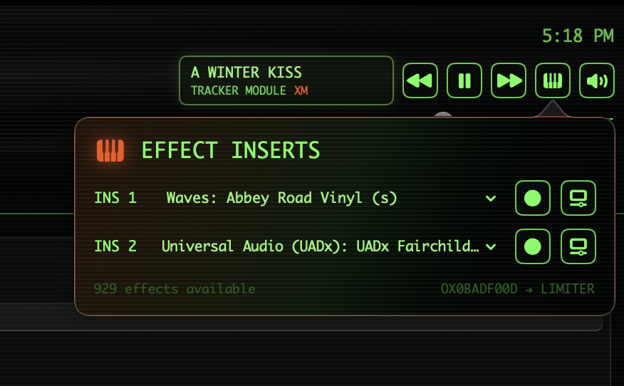
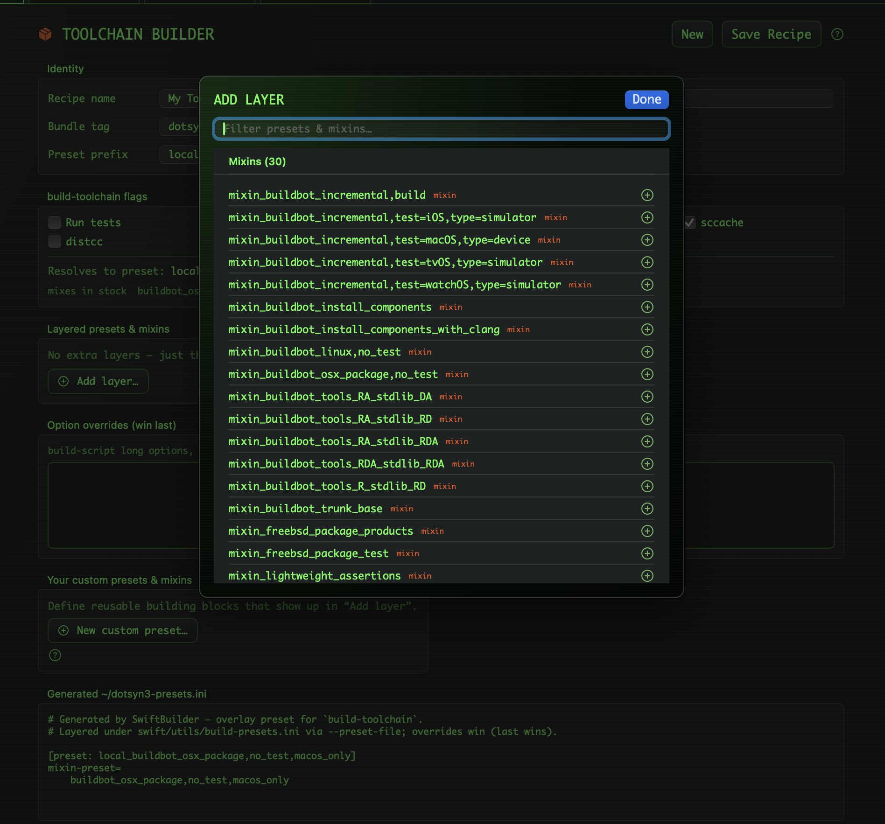
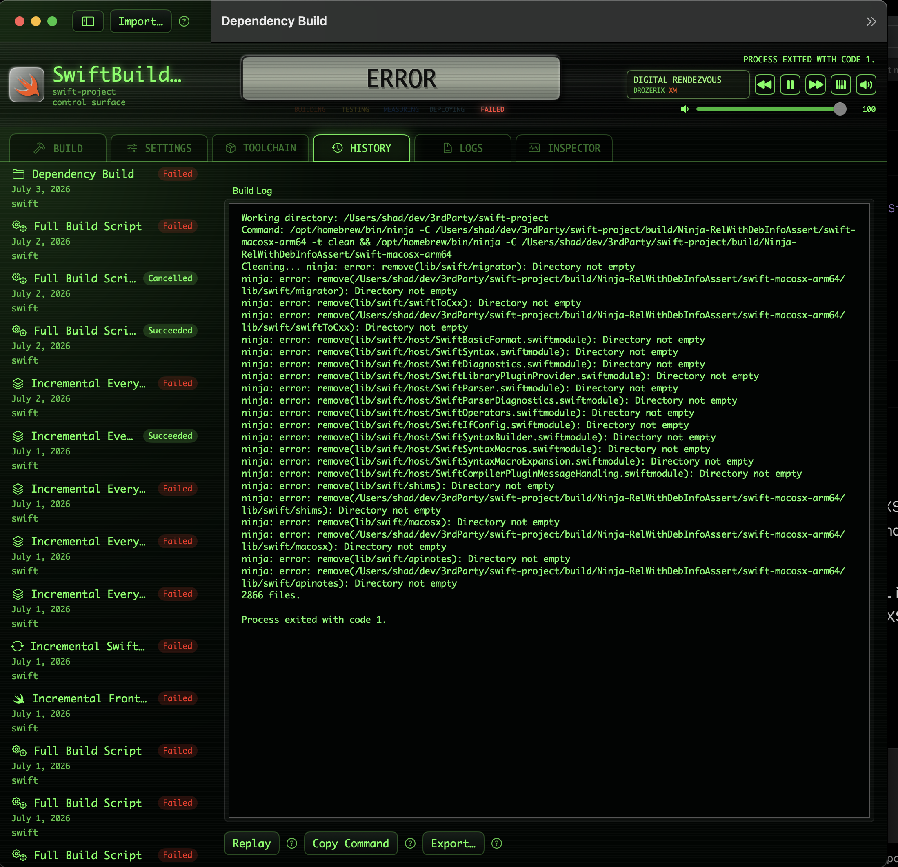
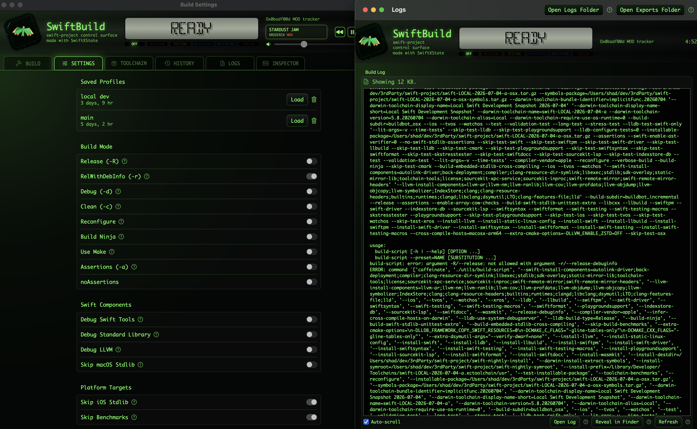
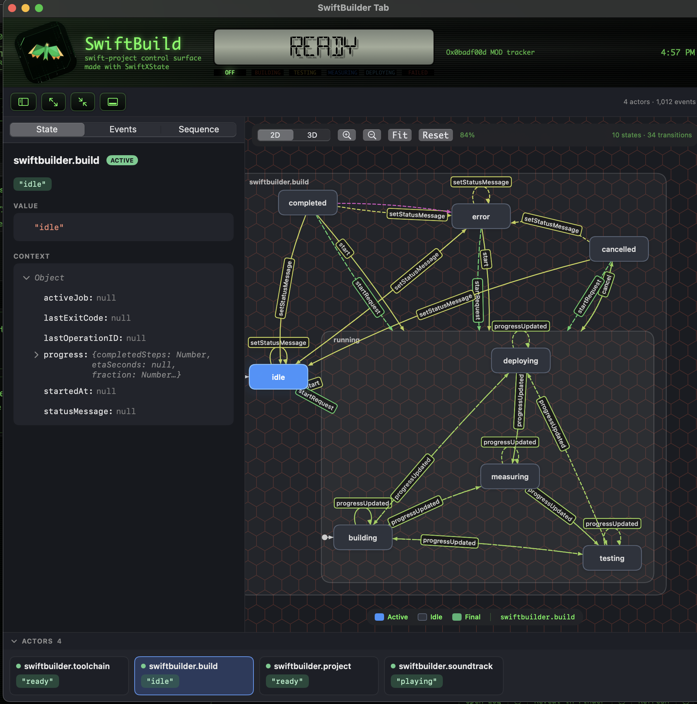

# SwiftBuild
## a [swift-project](https://github.com/swiftLang/swift) control surface  with music from [Ox0badf00d](https://github.com/gistya/Ox0badf00d) 3D psychoaccoustic tracker built with [SwiftXState](https://github.com/gistya/SwiftXState) statechart orchestration system & rendered with [SwiftUI](https://developer.apple.com/swiftui) in retro terminal green

  ... 

# Who is this for?

This app is best for people who are already familiar with the process of building the Swift compiler and toolchain using terminal commands from the source code ([ here](https://github.com/swiftlang/swift)) using the scripts in swift/utils. Though not necessary, you'll probably find this app a lot more approachable and understandable if you've already done some builds using terminal commands first. 

Ultimately, this app is just a wrapper around those terminal commands. It's just providing you the convenience of easily saving and recalling custom commands sets, viewing past runs and logs, and having a nice soundtrack that stops playing when a build stops for any reason, so you'll know without having to constantly monitor it.

# What are the featuers of SwiftBuild?

The SwiftBuild app:

- provides a GUI wrapper for the following swift/utils build scripts: [update-checkout](https://github.com/swiftlang/swift/blob/main/utils/update-checkout), [build-script](https://github.com/swiftlang/swift/blob/main/utils/build-script), and [build-toolchain](https://github.com/swiftlang/swift/blob/main/utils/build-toolchain) 
- persists custom settings profiles, build history, and UI interface state in a SwiftData SQLite store in `~/Library/Application Support/com.physicalsoftware/SwiftRepoGUI`
- lets you save, name, and recall custom build-script settings profiles and build-toolchain "recipes" 
- exposes all the settings in build-script and remembers how you last customized them (even if you didn't manuallys save them)
- provides a live view of the ongoing build log and a progress bar for the current build phase (reflecting the progress % shown in the build-script stdout)
- saves all past build logs to a folder in the Application Support area, which you can quickly reopen
- lists all past builds in the History tab and lets you replay the same build commands with a single click
- exposes all the mixins and presets from [build-presets.ini](https://github.com/swiftlang/swift/blob/main/utils/build-presets.ini) (plus any .ini's found in your home directory)
- provides an interface for composing those presets and mixins into custom `build-toolchain` "Recipes", which you can save/recall and also are persisted as custom .ini files
- supports full UI customization and randomization for colors and fonts, and includes two retro-themed light and dark presets
- includes an embedded EDM music player based on the Amiga .mod/.xm format (implementation of the [tracker format](https://en.wikipedia.org/wiki/Music_tracker)), a type of music sequencer that plays small MIDI-like files
- the music player's reason for being in this app is that it stops playing the music when the build stops for any reason, so that you'll know when your build has finished or died etc.
- the music player also features a custom built-in psychoaccoustic 3D algorithm that enhances the perceived soundfield
- the music player also features two AudioUnit effects insert slots that support any audio plugins you may have, to further customize the sound 
- includes some public domain .mod and .xm tracks from [The Mod Archive](https://modarchive.org); feel free to add or remove tracks by dropping them into `SwiftRepoGUI.app/Contents/Resources` or deleting them from there

... plus whatever goodies I may have added lately.

# Environment Setup Tips

First of all read all the READMEs on https://github.com/swiftlang/swift and follow what they say.

1. Use the Xcode python3 or install the universal form of Python3 from python.org. The last version as of July 12, 2026, that works for building Swift is 3.13.x. (3.14 introduced breaking changes for this process.) However `brew install python3` won't give you a universal version, and then if you build for x86 on Apple Silicon, you'll have issues.
2. Run `pip3 install psutil`
3. Run `brew install sccache` and `brew install ninja`
4. Make sure to install and then `sudo xcode-select -p /path/to/Xcode` with the version of Xcode that is shown on https://ci.swift.org/ under "Node information" at the top. 
5. Go to https://developer.apple.com/download/all/. Download and install the version version of Xcode. (Rename it to Xcode_16.2.app or whatever, if you don't want to overwrite your newer Xcode.)
6. Open that version of Xcode and open the Devices & Simulators window. On simulators tab, add any missing simulators that don't appear in the list. Make sure to add the version of simulator that shipped with that version of Xcode. Otherwise, your tests might fail with errors like "Symbol not found … (built for iOS-sim 18.0 which is newer than running OS) … Expected in: … iOS 17.0.simruntime … Foundation". (Or don't bother with simulators and make sure you use settings to only bulid for macOS).
7. Create a folder called "swift-project" somewhere convenient. Within this folder, clone the repo from https://github.com/swiftlang/swift, such that you now have a folder at swift-project/swift.
8. Open the SwiftBuilder app. On the top right of the Build tab, click "Choose..." and select your swift-project folder. 
9. Select an appropriate checkout scheme (picks the version of Swift to build). If you're on a custom branch, leave it on auto. 
10. Then click "Update & Clean Tree" to checkout all the dependency repos. 
11. In the Settings tab and customize your settings. (These are the flags sent to the build-script in the Swift repo.)
12. In the Build tab, click Full Build Script. (Takes a few hours. On subsequent rebuilds you can use incremental modes to save time.)

Most importantly, have fun. Building Swift from source can be frustrating. I find that music helps. 

# Building Swift Never Sounded This Good

### Insert up to two of your favorite audio plugins to process the mesmerizing sound of old school .mod, .xm, and .it files being piped in from all-Swift Ox0badf00d tracker:

 ... 

# Manage Toolchain Mixins With Ease

### Artfully compose your ideal toolchain build from a dynamically-populated list of options from `build.ini`. *SwiftBuild* automatically crafts your custom `.ini` for you, and lets you add additional flags to it. Then, save your toolchain "Recipe" for easy later recall.

 ... 

# Relive All Your Past Failures and Successes. 

### Remember that one time you built Swift successfully? It's saved right here. Replay that exact build again... it might still work. 

 ... 

# Watch Realtime Logs as You Plan the Next Run.

### Every setting from the build script is here. Save a set of settings for later recall. (*SwiftBuild* remembers your last setup even if you didn't save it before exit.) And thanks to SwiftXState's `actor`-based design, nothing ever blocks the main thread. So you can watch your logs stream by while you setup the settings for your next build. Just drag a tab out and it becomes a separate window.  

 ... 

# Inspect the State-Machinery and Live Events

Thanks to the open [Stately.ai](https://stately.ai) [XState](https://github.com/stately/xstate)-format state machine inspection protocol, SwiftXState allows you to inspect the statechart machinery orchestrating *SwiftBuild*'s logic. Run into a bug? Pull up the Inspector tab and check the state snapshots and event timeline for details. No debugger connection necessary. Or just watch the state machine perform its magic in realtime as your build proceeds. 

 ... 

# About *SwiftBuild*

This is a passion project and gift back to the awesome Swift community and the folks at Apple and elsewhere who created Swift. Hopefully *SwiftBuild* adds a little fun and music into the task of improving Swift. 

Someday hopefully we can make this thing cross-platform, but for now it is macOS only. Much of the machinery (such as SwiftXState) is already cross-platform, but at this time SwiftUI and some of the audio frameworks are not. That being said, the door is wide open for PRs to add cross-platform support.

Thanks! ~ Jonathan Gilbert, July 4, 2026

# Licensing

Permission is granted to use, modify, and contribute to this project. Redistribution of compiled binaries or publication to commercial application stores requires written permission from the copyright holder.
